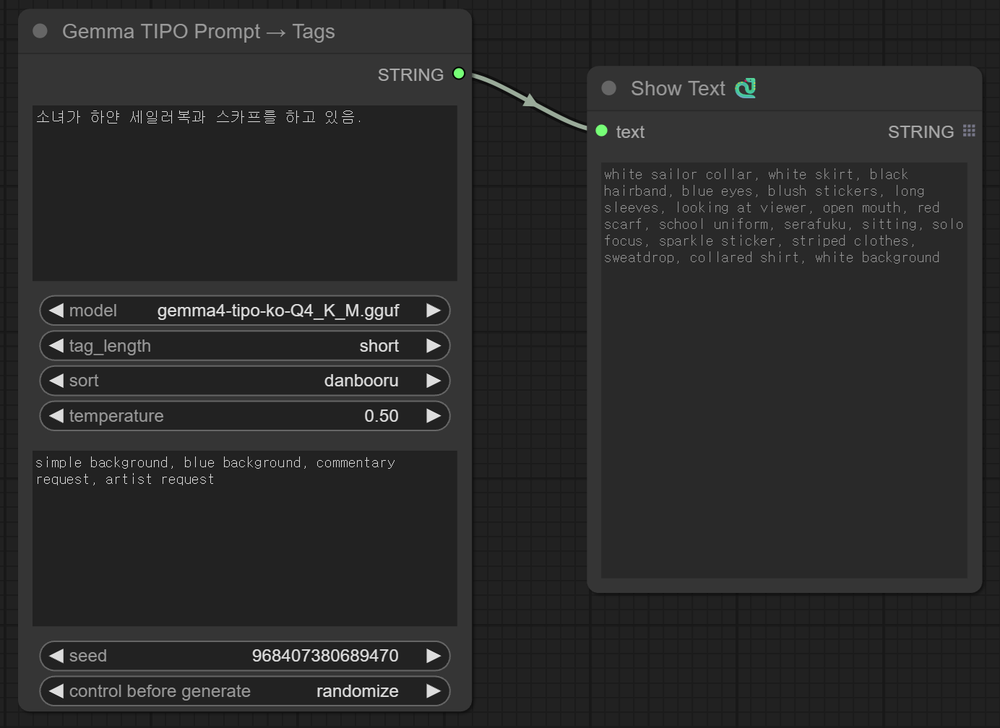
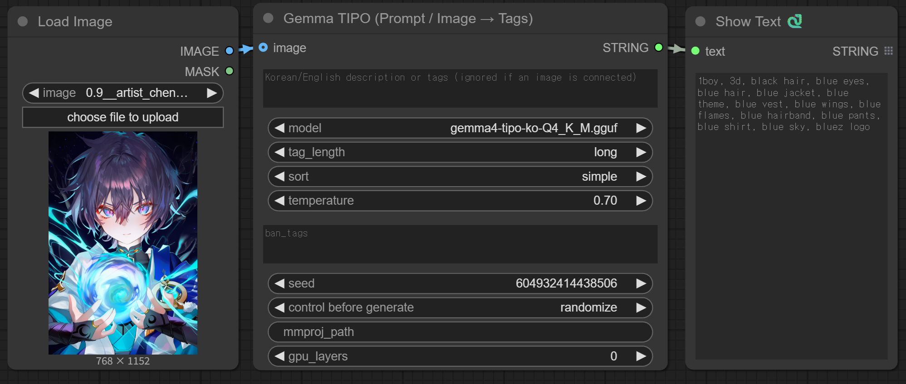

# RS-Seasonal-Prompt-Generator

*English | [한국어](README_KOR.md)*

 Generates season-specific fashion prompts by randomly combining fashion items, background settings, weather, time, and additional situational details from CSV data.

> **v2.7.0** merged the text and vision TIPO nodes into ONE node (image
> is an optional input — connect an image to use vision mode, otherwise
> it runs text mode) and added a `simple` sort preset. **v2.7.1** makes
> vision mode fully automatic on all platforms (the llama.cpp mtmd
> binary now auto-downloads on Windows / Linux / macOS, not just
> Windows). **v2.7.3** upgrades the auto-download default to the v2
> Korean TIPO fine-tune (`gemma4-tipo-ko-v2-Q4_K_M.gguf`, better
> color/attribute accuracy). See the changelog.

This pack provides **two independent nodes** (category: `prompt`):
1) Seasonal Fashion Prompt Generator (CSV, zero-dep), 2) Gemma TIPO
(Prompt / Image → Tags). Install by cloning/copying this folder into
`ComfyUI/custom_nodes/` and restarting ComfyUI. Each outputs a `STRING`;
they're chainable.

## Showcase



Korean natural language in → clean English Danbooru tags out:

> **In:** `소녀가 하얀 세일러복과 스카프를 하고 있음.`
>
> **Out:** `white sailor collar, white skirt, black hairband, blue eyes,
> blush stickers, long sleeves, looking at viewer, open mouth, red scarf,
> school uniform, serafuku, sitting, solo focus, sparkle sticker, striped
> clothes, sweatdrop, collared shirt, white background`

And **vision mode** — connect an image, get a plausibly-expanded
Danbooru tag set (TIPO-style; not exact labeling):



## Node 1 — Seasonal Fashion Prompt Generator

The original generator. Pick a `season` and toggle the fashion / background /
weather / pose / situation options; it returns a comma-separated prompt
randomly combined from the bundled CSV data. **Zero dependencies** — nothing
is installed and nothing runs a model.

## Node 2 — Gemma TIPO (Prompt / Image → Tags)

One unified node. **Connect an `image` → vision mode** (the image is
captioned via Gemma-4 vision = llama.cpp `mtmd` + auto-downloaded base
gemma-4-E2B `mmproj`). **No image → text mode** (the `prompt`, Korean/
English NL or tags, is expanded in-process via `llama-cpp-python`).
Either way the output runs through the same `kgen.formatter`
post-processing (sort / dedup / drop-redundant / count-conflict).

> ⚠️ **Vision mode is NOT an accurate image tagger.** It is *not* a
> labeling/captioning model that faithfully describes what is in the
> image. It deliberately exploits the LLM's **hallucination**: it takes
> the image only as a loose seed and **randomly expands it into a
> plausible, invented tag set** (TIPO-style creative upsampling). The
> output will include tags that are *not actually present* in the image
> and will vary run to run. Use it to generate varied prompt ideas for
> text-to-image — **do not** use it when you need exact tags for the
> given image.

Text mode accepts **Korean or English natural language**, not just tags:

| Input | Output (example) |
| --- | --- |
| `spring, white blouse, pleated skirt, park` | `spring, white blouse, pleated skirt, park, outdoors, school uniform, long sleeves, sitting, solo, …` |
| `빨간 원피스, 밀짚모자, 해변` (Korean) | `straw hat, red one-piece swimsuit, sun hat, beach, ocean, swimsuit, outdoors, …` |

Inputs:
- `prompt`: text to convert (Korean/English NL or tags).
- `model`: a dropdown of the `*.gguf` files found in
  **`ComfyUI/models/gguf/`**. Pick `(auto: download default)` to fetch the
  default model (`gemma4-tipo-ko-v2-Q4_K_M.gguf` from
  [`raspie/gemma4-tipo-ko-gguf`](https://huggingface.co/raspie/gemma4-tipo-ko-gguf))
  into that folder on first use — a **progress bar shows on the node** while
  it downloads (reused afterward, never re-downloaded); or drop your own
  `.gguf` into `ComfyUI/models/gguf/` and select it (reload the node list to
  see new files).
- `tag_length`: target verbosity (`very_short` … `very_long`).
- `sort`: prompt-ordering preset applied by `kgen.formatter` (tags are
  categorized special/characters/copyrights/artist/general/quality/meta/rating):
  - `danbooru` (default): artist, rating, special, characters, copyrights,
    general, quality, meta.
  - `quality_first`: quality tags lead.
  - `artist_first`: artist/character lead.
  - `general_only`: keep only special + characters + general tags.
  - `simple`: only special, rating, general.
- `temperature`: sampling temperature.
- `ban_tags`: comma-separated tags to strip from the result.
- `seed`: changes the expansion for variation.
- *(optional)* `image`: connect a ComfyUI IMAGE to switch to **vision
  mode** (image → tags). **Fully automatic** — first vision use
  auto-downloads the prebuilt llama.cpp mtmd binary for your OS/arch
  (Windows / Linux / macOS · x64 / arm64, no build) **and** the base
  gemma-4-E2B mmproj. Nothing to install or configure by hand.
- *(optional, vision only)* `mmproj_path`: **leave empty** — the base
  mmproj is auto-downloaded. Only set this to point at your own mmproj.
  `gpu_layers`: `0` = CPU (default); raise to offload layers to GPU.

Notes:
- Longer / more detailed descriptions yield more and more accurate tags.
- The raw input text (incl. Korean) is **not** mixed into the tag output.
- Redundant general tags are dropped to save tokens: if a more specific tag
  with the same head noun exists (e.g. `white skirt`), the bare `skirt` is
  removed. Distinct tags like `dress`/`dress shirt` are kept.
- Conflicting person-count tags are collapsed per group: with `1girl`
  present, `4girls` / `multiple girls` are removed (`1girl` + `1boy` is
  kept — groups are independent).
- On any failure (missing deps, model unavailable, inference error) it falls
  back to the input text unchanged — it never hard-errors.

### Supported environment & requirements

| | |
| --- | --- |
| **OS** | Windows / Linux / macOS — anywhere ComfyUI runs and a `llama-cpp-python` wheel exists (x86-64, Apple Silicon/arm64) |
| **Node 1 (Seasonal)** | Any ComfyUI install. Zero dependencies, no model. |
| **Node 2 (Gemma TIPO)** | CPU-only works (no GPU required); GPU optional for speed |
| **RAM** | min ~8 GB (≈5 GB used for the 4-bit model) · 16 GB+ recommended |
| **Disk** | ~4 GB free (3.2 GB GGUF + deps) |
| **Speed** | CPU inference works but is slow (a single prompt can take minutes); a GPU-accelerated `llama-cpp-python` build is recommended for speed |
| **Python** | ComfyUI's embedded env; `llama-cpp-python >= 0.3.23` (auto-installed/upgraded, one restart prompt) |

### Install (Node 2 only)

**No manual install is required.** The first time you actually run Node 2,
its dependencies are auto-installed into the active environment once:
`tipo-kgen` (pure-Python) and `llama-cpp-python` **>= 0.3.23**
(from the prebuilt CPU wheel index, so no native build). Older builds cannot
load the gemma4 architecture, so an existing too-old `llama-cpp-python` is
upgraded automatically — if that happens mid-session ComfyUI will ask you to
**restart once** (a C-extension can't be hot-reloaded). Node 1 never installs
anything.

To pre-install manually instead (optional):

```
pip install -r requirements.txt
```

If the prebuilt `llama-cpp-python` wheel install can't find a wheel for your
platform/Python, install it yourself once:

```
pip install llama-cpp-python --extra-index-url https://abetlen.github.io/llama-cpp-python/whl/cpu
```

## References & Credits

| Project | Use | License |
| --- | --- | --- |
| [KGen / TIPO](https://github.com/KohakuBlueleaf/KGen) by KohakuBlueleaf | `kgen.formatter` for tag categorization & prompt sorting | Apache-2.0 |
| [z-tipo-extension](https://github.com/KohakuBlueleaf/z-tipo-extension) by KohakuBlueleaf | Reference implementation of the TIPO node flow; training-data lineage | Apache-2.0 |
| [llama.cpp](https://github.com/ggml-org/llama.cpp) | GGUF inference engine; prebuilt `llama-mtmd-cli` for vision mode | MIT |
| [llama-cpp-python](https://github.com/abetlen/llama-cpp-python) | Python bindings for in-process GGUF inference | MIT |
| [Gemma](https://ai.google.dev/gemma) by Google ([`google/gemma-4-E2B-it`](https://huggingface.co/google/gemma-4-E2B-it)) | Base model family the TIPO GGUF derives from | Gemma Terms of Use |
| [`p-e-w/gemma-4-E2B-it-heretic-ara`](https://huggingface.co/p-e-w/gemma-4-E2B-it-heretic-ara) | Decensored gemma-4-E2B the default Korean TIPO GGUF was fine-tuned from (used so over-censoring doesn't corrupt explicit Danbooru tag output) | Gemma Terms of Use |
| [`unsloth/gemma-4-E2B-it-GGUF`](https://huggingface.co/unsloth/gemma-4-E2B-it-GGUF) by Unsloth | Base gemma-4-E2B `mmproj-F16.gguf` auto-downloaded for vision mode | Gemma Terms of Use |
| [`raspie/gemma4-tipo-ko-gguf`](https://huggingface.co/raspie/gemma4-tipo-ko-gguf) | Default Korean→tags TIPO model auto-downloaded by Node 2 | Gemma Terms of Use |

The TIPO expansion concept ("upsample"/expand short prompts into detailed
Danbooru tag sets) originates from KohakuBlueleaf's KGen/TIPO and the
[z-tipo-extension](https://github.com/KohakuBlueleaf/z-tipo-extension); the
default model's fine-tune training data follows that same lineage.
